# Activitat GitHub

## Apartat A. Repositori individual:

**1. Abans de crear el nostre primer repositori, haurem de configurar el nostre compte de GitHub amb una clau SSH per tal de poder-nos-hi connectar des del nostre ordinador. Seguiu el tutorial de la pàgina web de GitHub on indica com crear una clau SSH i el tutorial on explica com afegir la clau a GitHub. Inclou captures de pantalla del terminal on has creat el certificat i de la web de GitHub amb el certificat configurat.**

  Imatge del terminal amb el certificat:

  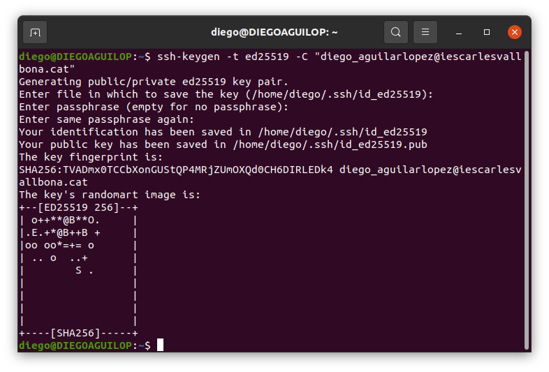

  Imatge de la web de GitHub amb el certificat configurat:

  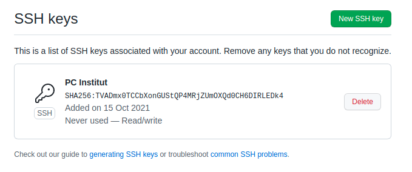

**2. Crea un nou repositori a GitHub amb el nom «vallbona». Inclou una captura de pantalla on aparegui el nou repositori.**

  Imatge del nou repositori "vallbona":

  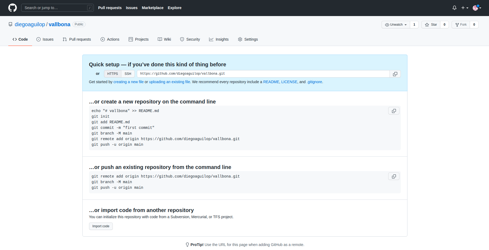

**3. Crea un repositori «vallbona» en el teu ordinador. Crea una branca «main» amb un fitxer «readme.md» dins. Fes-ne commit i puja el repositori a GitHub. Indica les comandes que has utilitzat.**

  1. Crear repositori "vallbona":

    ***git init vallbona***

  2. Crear branca "main" i situarte a aquesta:

    ***git branch main***

    ***git checkout main***

  3. Crear fitxer "readme.md":

    ***touch readme.md***

  4. Fer commit dels canvis:

    ***git commit -m "Creació readme.md"***

  5. Per pujar el repositori al GitHub tens que posar les següents comandes:

    ***git remote add origin git@github.com:diegoaguilop/vallbona.git***

    ***git branch -M main***

    ***git push -u origin main***

**4. Crea una branca anomenada «dev» i actualitza el repostori amb GitHub. Indica la comanda utilitzada.**

  1. Crear una branca anomenada "dev":

    ***git branch dev***

  2. Actualizar el repositori amb GitHub:

    ***git push -u origin dev***

**5. Crea un fitxer anomenat «index.html» i actualitza el repositori amb GitHub. Indica les comandes utilitzades.**

  1. Crear fitxer "index.html":

    ***touch index.html***

  2. Afegir fitxer al seguiment:

    ***git add .***

  3. Fer commit del fitxer:

    ***git commit -m "Creació index.html"***

  4. Actualizar el repositori:

    ***git push -u origin dev***

**6. Crea el pull request amb un comentari indicant els canvis que has realitzat en el commmit que has fet. Adjunta una captura de pantalla un cop enviat el «pull request».**

Imatge del pull request:

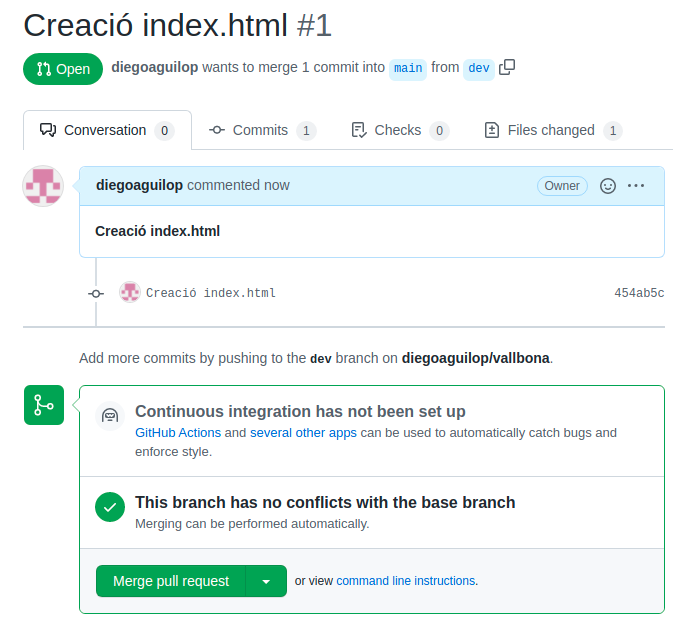

**7. Accepta el pull request i realitza el merge amb «main». Adjunta captura de pantalla on es vegi que has realitzat el merge.**

Imatge del merge amb "main":

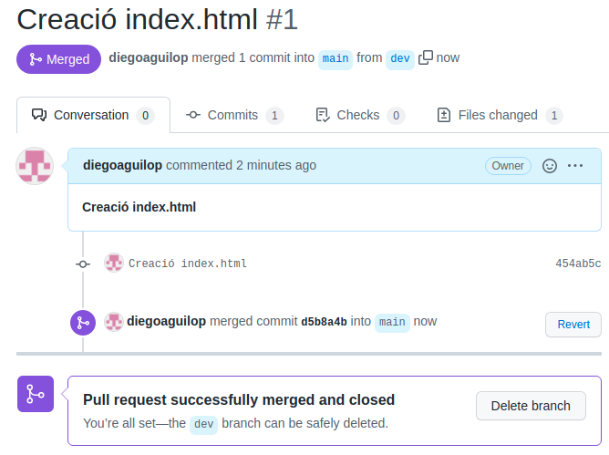

**8. Torna al teu repositori local i situat a la branca «main». Està actualitzada amb el repositori de «GitHub»? Indica que cal fer per a que ho estigui. Escriu la comanda a realitzar.**

  1. Comanda per actualitzar el repositori de forma local:

    ***git pull***

**9. Clona el repositori «git@github.com:jvallbona/exercici2.git». Crea una branca anomenada «solucio». Indica la comanda que has utilitzat.**

  1. Clonar el repositori:

    ***git clone git@github.com:jvallbona/exercici2.git***

  2. Crear branca "solucio":

    ***git branch solucio***

**10. Realitza en la branca el que demana el fitxer «Exercici09.css» per tal que el fitxer HTML quedi com la imatge «Resultat09.png». Adjunta una imatge a pantalla completa del teu ordinador amb un navegador visualitzant el fitxer «Exercici09.html».**

Imatge en pantalla completa visualitzant "Exercici09.html":

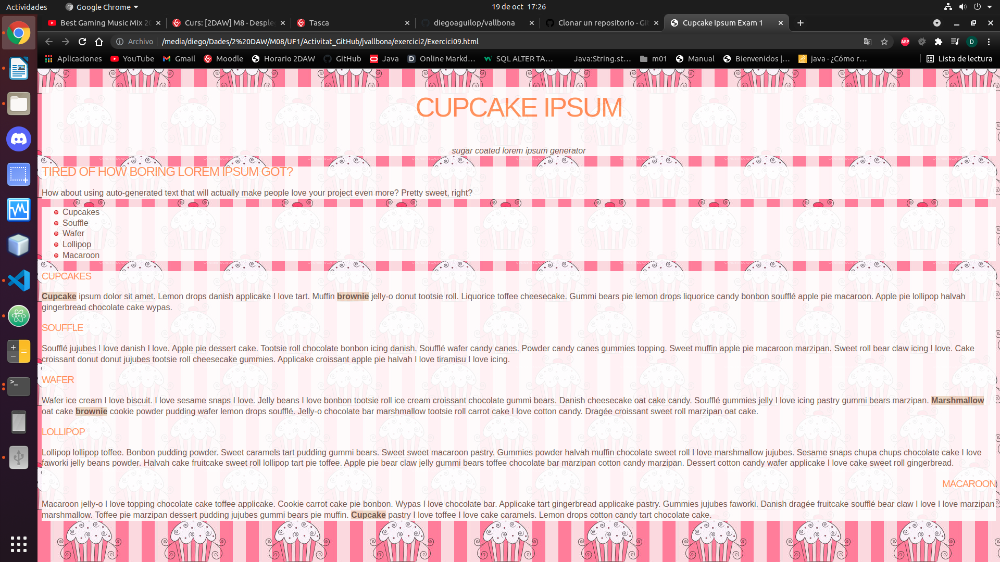

**11. Puja el resultat en un repositori de la teva propietat. Adjunta el link per a poder-lo clonar.**

***git@github.com:diegoaguilop/jvallbona.git***

**12. Realitza un «fork» del repositori del repositori «git@github.com:jvallbona/exercici2.git». Què ha passat? Adjunta una captura de pantalla del teu repositori.**

Ha passat que he afegit al meu repositori una copia exacta del repositori exercici2.git.

Imatge en pantalla completa del meu repositori:

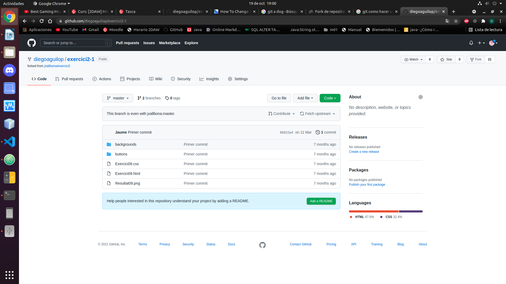

**13. Crea una branca anomenada «dev» i situat en ella. Canvia la imatge del fons de pantalla per aquesta:  https://images.twinkl.co.uk/tr/image/upload/illustation/Birthday-Cake-.png Adjunta una captura de pantalla del navegador amb els canvis realitzats.**

  1. Crear branca "dev" i situarme a ella:

    ***git branch dev***

    ***git checkout dev***

    Imatge amb el canvis realitzats:

    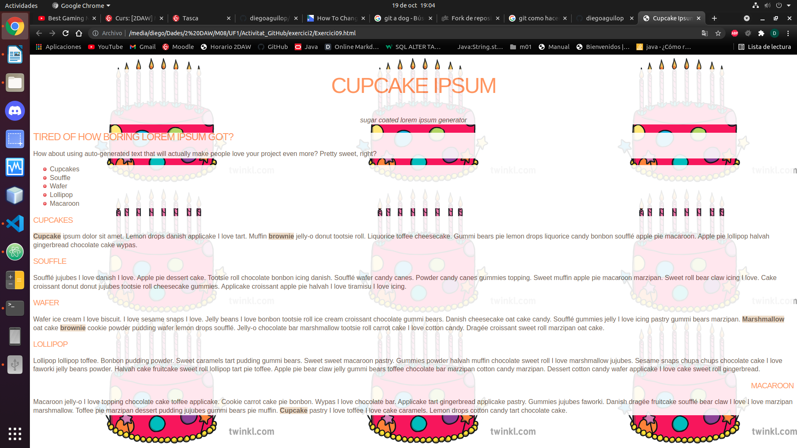

**14. Puja els canvis al repositori de GitHub. Indica la comanda. Fes una captura de pantalla del pull request que s’ha creat. En quin repositori s’està demanant fer el pull a «main»? Escriu el teu nom en els comentaris del «pull request» i fes clic al botó «Create pull request».**

  1. Comanda per pujar els canvis a GitHub:

    ***git push -u origin --all***

  Imatge del pull request:

  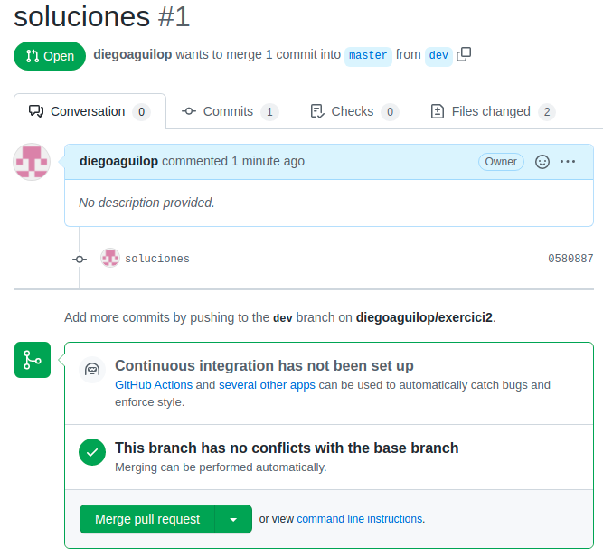

  2. En quin repositori s’està demanant fer el pull a "main"?

  M'està demanant fer el pull de la branca "dev" i "solucion"

## Apartat B. Col·laboratiu:

**15. Un dels membres del grup ha de crear un nou repositori privat en el seu compte de GitHub.**

**A continuació, haurà de convidar l’altre membre del grup i a l’usuari jselga a afegir-se com a col·laborador (secció Settings).**

Imatge de la convidació:

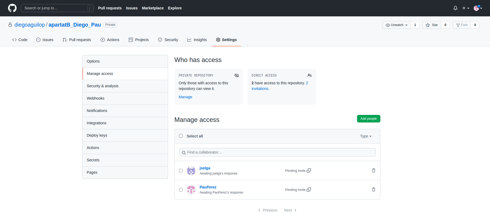

Link convidació:

**https://github.com/diegoaguilop/apartatB_Diego_Pau/invitations**

Nom d'usuari que crea el repositori: ***diegoaguilop***

**16. Tots dos alumnes heu de crear-vos un repositori local, amb el nom que desitgeu. Cal crear una carpeta en local i crear el repositori Git per terminal.**

  1. Creació del repositori en local:

    ***git init apartatB_Diego_Pau***

  2. Enllaçar amb GitHub:

    ***git remote add origin git@github.com:diegoaguilop/apartatB_Diego_Pau.git***

    ***git branch -M main***

    ***git push -u origin main***

**17. Feu commit cada alumne des del repositori local.**

**Fixa’t que commit aplica els canvis en local, però fins que no fem push no s’envia al repositori remot.**

**En refrescar al repositori de GitHub, s’han de veure els dos missatges de commit.**

  1. Creació fitxer i fer el commit:

    ***echo "# Hola soy Diego" >> fitxerDiego.md***

    ***git add .***

    ***git commit -m "Creacio fitxerDiego"***

    Imatge del commit:

    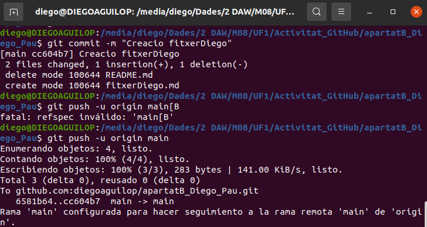

**18. Proveu ara de crear fitxers en local (un fitxer per alumne amb noms diferents). Actualitzeu el repositori remot amb les comandes adequades i adjunteu captura dels canvis. Que passaria si els fitxers es diguessin igual?**

  1. Comanda per actualitzar repositori remot:

    ***git push -u origin main***

  Imatge del repositori amb el canvis:

  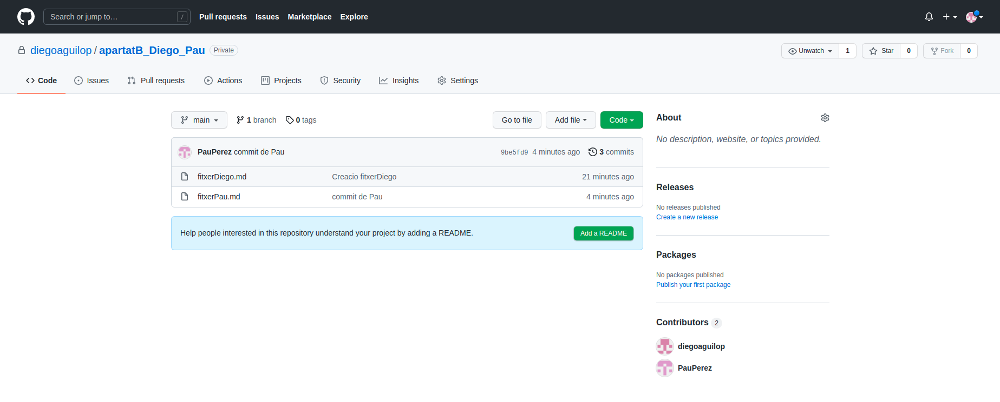

  Si els fitxers es diguessin igual el que pasaria es que hi hauria un col·lisió de canvis en el mateix document i no deixaria fer el push.

**19. Cada alumne ha de crear una nova branca amb un checkout. Per exemple les braques alumne1 i alumne2.**

  1. Crear branca nova:

    ***git branch diego***

**Proveu de crear cadascú diversos fitxers i fer push al repositori remot (sempre a la vostra branca!).**

  1. Creació de fitxers:

    ***touch hola.txt***

    ***touch adios.txt***

    ***touch aaa.txt***

**Feu també la prova de canviar-vos amb checkout a la branca del vostre company. Observa com canvia el contingut de la teva carpeta local!**

  1. Actualitzar repositori:

    ***git pull***

    Imatge de la branca del meu company:

    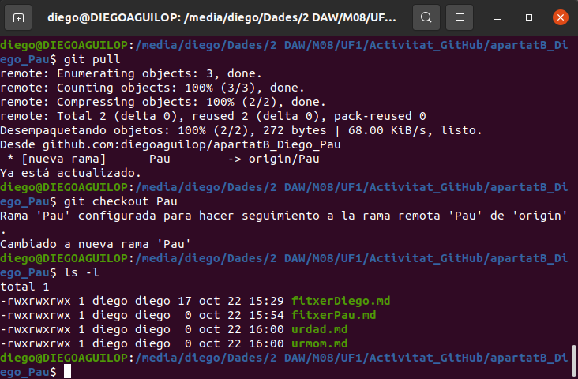

**20. Crearem una branca dev, i cadascun dels alumnes farà merge amb la branca dev un cop finalitzi la seva feina.**

  1. Crear branca "dev":

    ***git branch dev***

**Feu tots els integrants del grup merge a la branca dev.**

  1. Merge a la branca "dev" de "diego":

    ***git checkout dev***

    ***git merge diego"***

    Imatge del merge a "dev":

    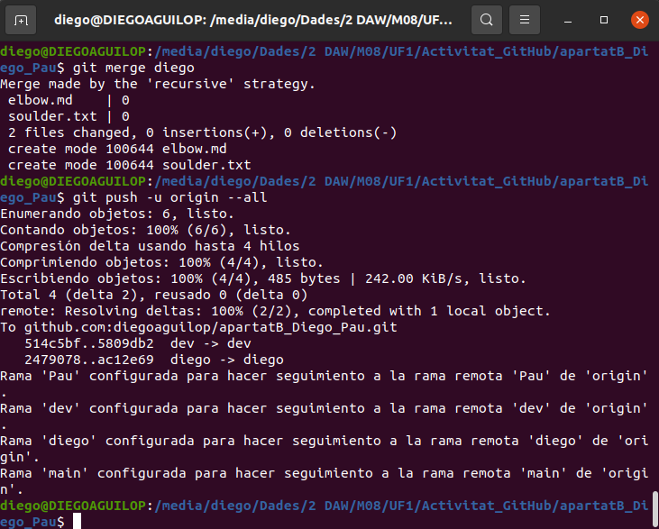

**21. Un cop fet el merge a develop, resolts els conflictes i «testejada l’aplicació», podem fer merge de la branca develop amb la master.**

  1. Merge a la branca "main" de "dev":

    ***git checkout main***

    ***git merge dev***

    Imatge del merge a "main":

    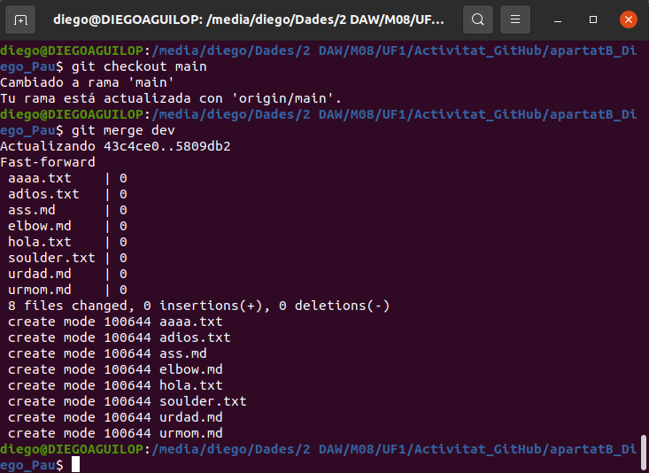
